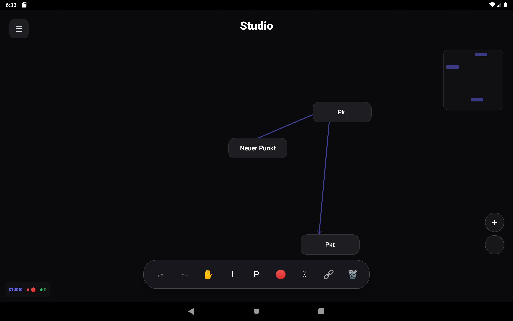
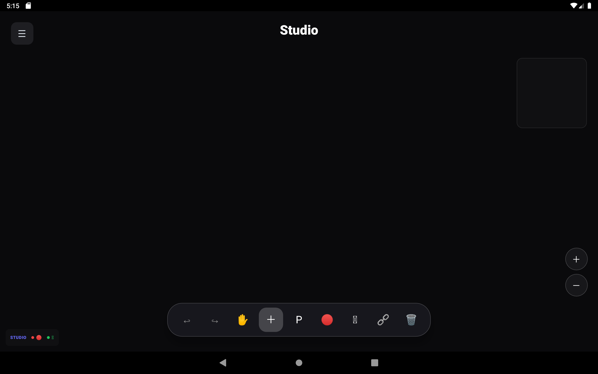

# NeuroDumpling - Professional MindMapping for Android

NeuroDumpling is a professional-grade MindMapping and ConceptMapping application designed for clarity, efficiency, and cross-device portability (Smartboards, Tablets, Phones).

## 🚀 Key Features
- **MindMap & ConceptMap Modes**: Seamlessly switch between structured mind maps and free-form concept maps.
- **Advanced Gesture Engine**: Non-blocking Panning and Zooming optimized for Smartboards.
- **PESR Categorization**: Integrated professional categories (Problem, Einfluss, Symptom, Ressource) with visual badges.
- **High-Fidelity Export**: High-quality PNG, PDF, and SVG exports with structured sidebar legends.
- **JSON Compatibility**: Full import/export parity with the [MindDumpling Desktop (4WIN)](https://github.com/as3-as3/MindDumpling_4WIN) version.

## 📸 Visual Previews

  
  

## 📦 Installation
1. Download the latest APK: [NeuroDumpling_v1.1.apk](./NeuroDumpling_v1.1.apk)
2. Open the file on your Android device.
3. Allow "Install from unknown sources" if prompted.
4. Enjoy MindMapping!

## 📥 Import / Export
- **JSON**: Use the JSON export to backup your work or move it to another device.
- **PNG/PDF/SVG**: Export your maps for documentation. These will be saved in your `Documents/NeuroDumpling` folder.

## 🛠 Tech Stack
- **Language**: Kotlin
- **UI Framework**: Jetpack Compose
- **Local Storage**: Room Database
- **Export Engine**: Custom Canvas Rendering

---
*Created by [as3-as3](https://github.com/as3-as3)*
